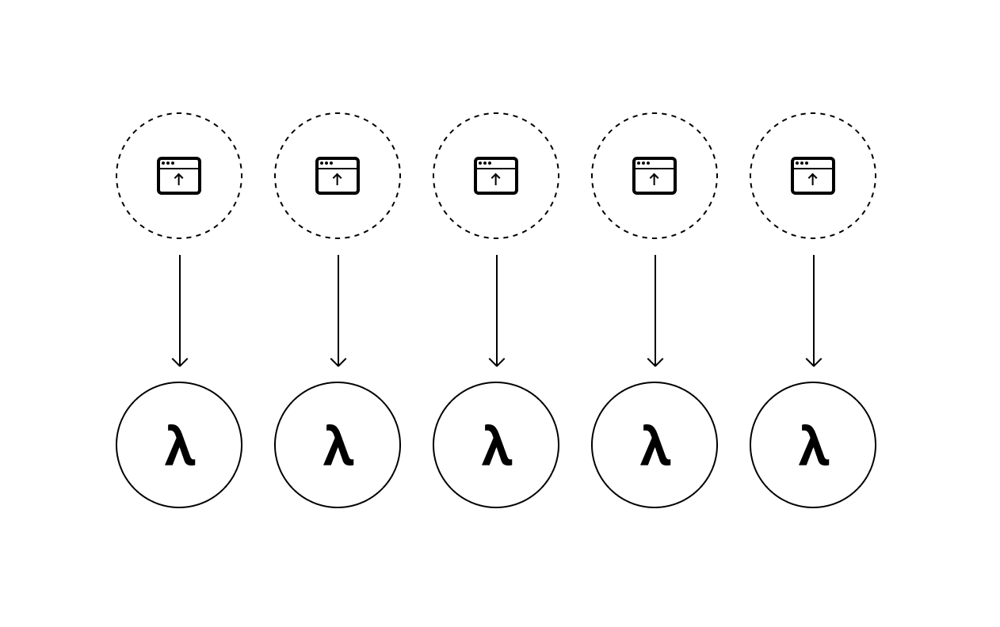

import condensed from '@mdx-deck/themes/condensed'
import highlight from '@mdx-deck/themes/syntax-highlighter-prism'

export const themes = [
  condensed,
  highlight
]
import { Image } from '@mdx-deck/components';
import { Split, Horizontal } from '@mdx-deck/layouts';

# Serverless Lambdas + Now v2

Mattia Asti 20/06/2019

https://github.com/mtt87/ks-serverless-now

---

<Split>


### Traditional world

- Load balancing
- Cluster
- Scaling ?
- 1 server * N requests


</Split>

---

<Split>



### Serverless Lambdas

- Invisible API gateway
- Infinite scaling
- 1 lambda * 1 request


</Split>

---

## λ Lambda function

```js
module.exports = (req, res) => {
  const data = { name: 'Mattia' };
  res.end(JSON.stringify(data));
};
```

---

### Cold vs Hot boot
Spawn the container and parse your function (< 1sec)

### Lifecycle and Scalability
 - scale to 0
 - no complex metrics dashboards
 - no scaling algorithms (1 function * 1 request)

---

## Advantages

- Code splitting for the backend
- Better security
- Easier to debug
- Faster cold boot times

---

https://zeit.co/now


---

### Local development

`now.json`

1 command for everything

`now dev`

---

<Horizontal>


</Horizontal>

---

### Deploy

`now`

---

### Bonus

Serverless Pre-Rendering (SPR)


